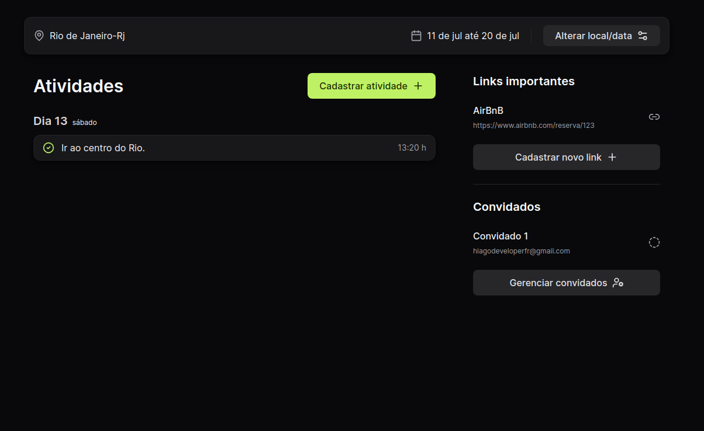

# plann.er

## Descrição do Projeto

O plann.er é um sistema de planejamento de viagens desenvolvido com Spring Boot, React e TypeScript. A plataforma permite que os usuários criem viagens, convidem participantes e gerenciem todos os aspectos de suas jornadas. Com o plann.er, é possível cadastrar atividades, adicionar links importantes e gerenciar convidados de forma prática e intuitiva.

## Funcionalidades Principais

- **Criação de Viagens:** Os usuários podem criar novas viagens especificando o destino e as datas.
- **Convite de Participantes:** Envie convites para amigos participarem da viagem, com confirmação via e-mail.
- **Cadastro de Atividades:** Adicione e gerencie atividades planejadas para a viagem.
- **Links Importantes:** Adicione links úteis relacionados à viagem, como reservas de hotéis ou restaurantes.
- **Gerenciamento de Convidados:** Controle e visualize os participantes da viagem, facilitando a comunicação e o planejamento conjunto.

## Tecnologias Utilizadas

- **Backend:** Spring Boot
- **Frontend:** React, TypeScript

## Telas

### Home

### Tela de Planejamento

